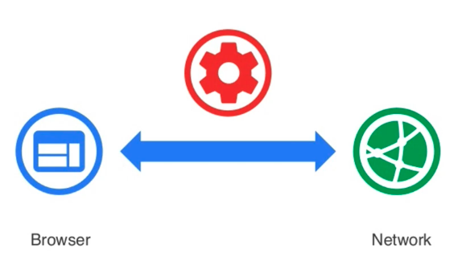
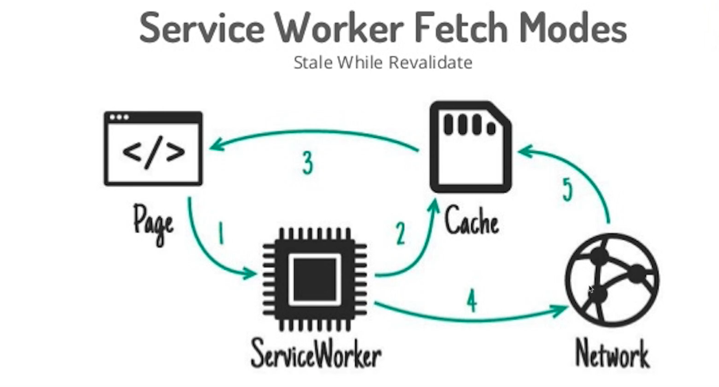

# PWA 시작하기

인프런 PWA 시작하기 수업을 위한 비공개 리포지토리입니다.

## 다루는 내용

### Progressive Web Apps

- google I/O 2016에서 소개된 미래의 웹 기술 이며 모바일 앱과 웹 기술의 장점을 결합시킨 웹앱.
- 해당 기술을 사용하면 앱을 별도로 설치할 필요가 없으며, 관련 된 앱을 푸시로 받을 수 있으며, 느린 네트워크에서도 빠르게 로드된다.
- PWA를 통해서 사용자는 모바일 앱과 같은 사용자 경험을 누릴 수 있으며 모바일 푸시, 오프라인이나 저속의 네트웍 속도에서의 사용, 무엇보다도 HTML, JAVASCRIPT, CSS를 이용하여 구현할 수 있습니다.
- PWA를 구현하ㅓ기 위해선 `mainfest.json`과 `Service workers`라는 2가지 기술이 필요 하다.

### Web App Manifest

- pwa의 설치와 앱 구성정보를 담고 있는 json형식의 설정 파일
- 앱 아이콘, 화면 런쳐 방식 및 뱃경색, 시작 페이지 등을 설정할 수 있는 json 파일

#### Web App Manifest 주요 구정 정보

1. App Icon

- 해당 웹 사이트가 모바일 화면에서 표시될 아이콘 이미지 지정
  `manifest.json`
  ```json
  {
    "icons": [
      {
        "src": "images/icons/192x.png",
        "type": "image/png",
        "sizes": "192x192"
      },
      {
        "src": "images/icons/512x.png",
        "type": "image/png",
        "sizes": "512x512"
      }
    ]
  }
  ```
  - `src`: 로딩할 이미지 파일 경로
  - `type`: 로딩할 이미지 타입
  - `sizes`: 로딩할 이미지 크기

2. Launch Image - Splash Screen

- 웹앱이 시작될 때 거치는 시작 화면 설정
- 모바일 앱의 시작과 동일한 느낌을 가져감
- 아이콘+이름+배경색 화면을 자동으로 꾸려주게 된다
- 배경색 설정은 `background_color` 속성
  `mainfest.json`
  ```json
  {
    "background_color": "#FDFDFD"
  }
  ```
  - 아이콘은 icon에 지정한 이미지중 192px에 가장 가까운 크기로 지정
  - 그러므로 192px크기의 이미지는 꼭 지정해야 한다.

3. Start Url

- 앱이 시작될 때 로딩 될 페이지 위치 지정
- 설정은 `start_url` 속성
  `mainfest.json`
  ```json
  {
    "start_url": "./"
    // GA 분석이나 기타 목적으로 query string을 뒤에 붙일 수 있다.
  }
  ```

4. Display Type

- 웹앱 화면의 전체적인 모양을 정할 수 있다.
- 웹앱이 모바일 앱의 느낌을 가져갈 수 있도록 결정짓는 속성
- 설정은 `display` 속성
  `mainfest.json`

  ```json
  {
    "display": "standalone"
  }
  ```

  - `standalone`: 상단 URL바 제거하여 네이티브 앱 느낌 제공
  - `browser`: 해당 OS 브라우저에서 웹앱 실행
  - `fullscreen`: 크롬이 아닌 기타 브라우저에서 네이티브 앱 느낌 제공
  - `minimul-ui`: fullscreen과 비슷하나 네비게이션 관련 최소 ui를 재공

5. Theme Color

- theme-color를 사용하면 앱 테마 색상을 정의할 수 있다.
- 홈 화면에서 시작해야 설정한 도메인의 모든 페이지 적용 가능
- 설정은 `theme_color`를 사용 한다.
  `mainfest.json`

  ```json
  {
    "theme_color": "#2196F3"
  }
  ```

6. Display Orientation

- 화면 방향(가로, 세로) 방향을 지정한다.
- 설정은 `orientation` 을 사용 한다.

```json
{
  "orientation": "portrait"
}
```

- `portrait`: 세로 방향
- `landscape`: 가로 방향

7. Web App Install Banner

- PWA가 모바일적인 특징을 가지는 가장 큰 부분의 하나
- 기존 모바일 앱 개발 주기: 구현 > SDK빌드 > 스토어 배포 > 검색 > 앱 다운로드 > 설치 > 사용
- PWA의 개발 주기: 구현 > 사이트 배포 > 검색 > 사용(자동설치)
  - `Install Banner동작 조건`
    1. 웹사이트가 모바일에 설치되어 있지 않아야 함
    2. 사용자가 최소 30초 이상 웹 사이트를 탐색(30초 이상 사용중이면 하단 배너가 실행이 됨)
    3. `start_url`, `short_name`, `name` 설정
    4. 최소 192px 크기의 앱 아이콘 이미지
    5. Service Worker의 fetch 이벤트 구현
    6. `HTTPS`

8. [기타 구성정보](https://developer.mozilla.org/ko/docs/Web/Manifest)

### Service Worker



- PWA에서 가장 중요한 역할 Offline Experience와 Mobile & Web Push의 기반 기술
- 브라우저와 서버 사이의 미들웨어 역할을 하는 스크립트 파일
- `미들웨어`: 보통 브라우저에서 서버를 요청하는 방식이지만 중간에 매개체가 생긴다 그걸 미들웨어(스크립트 파일)라 한다.
- 캐싱을 어떻게 할 것인시 요청 시 캐시를 먼저 보여줄지 웹서버를 통해서 먼저 보여줄지 push등등에 대한 프로그래밍 기술

#### Service Worker 특징

1. 브라우저의 백그라운드에서 실행되며 웹 페이지와 별개의 라이프싸이클을 가진다.(영역이 다르다)
   - javascript ui 쓰레드랑 별도로 동작하는 또 다른 쓰레드
2. 네트워크 요청을 가로챌 수 있어 해당 자원에 대한 캐시 제공 또는 서버에 자원 요청
   - 프로그래밍 가능한 네트워크 프록시
     `프록시`:중계서버
3. 브라우저 종속적인 생명주기(페이지가 종료 되더라도 서비스 워커는 죽지 않는다.)
4. Web & Mobile Push 수신이 가능하도록 Notification 제공
5. navigator.serviceworker로 접근
6. 기존 Javascript 와의 별개의 자체 스코프를 가진다.
   - 크롬 개발자 도구의 Console과의 별개의 서비스워커 전용 Console 존재
7. Dom에 직접적으로 접근이 불가능
8. 사용하지 않을 때 자체적으로 종료, 필요시에 다시 동작

#### Service Worker 배경

- 기존에 이미 존재하던 기술들을 보안하고 진화
  1. `AppCache`
     - 오프라인 경험을 제공하기 위한 캐시 제공, HTML 표준
     - 복수 페이지 앱에서 오동작, 파일 편화에 대해 둔감한 캐싱 문제
  2. `Workers`
     - 특정 작업중 화면과 관계없는 부분을 백그라운드에서 실행 및 처리하기 위한 수단
     - `종류`
       1. Dedicated Workers, 라이프 싸이클 - 페이지 종속적
       2. Shared Workers, 브라우징(브라우저) 컨텍스트
          javascript UI 쓰레드와 별개의 쓰레드
          페이지에 비종속적이며 직접적인 DOM접근 불가

#### Service Worker 등록

- `index.html`

```javascript
if ('serviceWorker' in navigator) {
  // 간단한 실행
  navigator.serviceWorker
    .register('./service-worker.js') //서비스 워커 등록
    .then(function (success) {
      // 성공
      console.log('[ServiceWorker Success]', success)
    })
    .catch(function (error) {
      // 실패
      console.log('[ServiceWorker Fail]', error)
    })
}
```

- 브라우저에 존재 유무를 확인 후 `register()` 사용

#### Service Worker 설치

- `register()`에서 등록한 스크립트 파일에서 `install()` 호출
- `service-worker.js`

```javascript
var CACHE_NAME = 'pwa-offline-v1' // 캐싱 스토리지에 저장될 파일 이름
var filesToCache = [
  // 캐싱할 파일 목록
  '/', // index.html
  '/css/app.css'
]
// 서비스 워커 설치 (웹 지원 캐싱)
self.addEventListener('install', function (event) {
  // self는 window를 의미 한다.
  event.waitUntil(
    caches
      .open(CACHE_NAME) // pwa 파일
      .then(function (cache) {
        // pwa 파일에 다 집어 넣어라
        return cache.addAll(filesToCache)
      })
      .catch(function (error) {
        return console.log(error)
      })
  )
})
```

- `waitUntil()`: 안의 로직이 수행될 때 까지 대기

#### Service Worker 네트워크 요청 응답



- 서비스워커 설치 후 Cache가 있으면 2번에서 3번으로 전달 되고
- 만약 없으면 4번으로 Network 요청 발생 시켜서 5번 Cache로 전달 한다.

```javascript
self.addEventListener('fetch', function (event) {
  console.log('[Service Worker] Fetch', event)
  event.respondWith(
    caches
      .match(event.request)
      .then(function (response) {
        return response || fetch(event.request)
        // 해당 부분이 Cache에 접근 하는 방법
      })
      .catch(function (error) {
        return console.log(error)
      })
  )
})
```

#### Service Worker 활성화 및 업데이트

- 새로운 서비스워커가 설치되면 활성화 단계로 넘어온다.
- 이전에 사용하던 서비스워커와 이전 캐시는 모두 삭제하는 작업 진행
- 새로운 캐시가 필요할때 `activate`가 필요 하다.

```javascript
// Service Worker 업데이트
self.addEventListener('activate', function (event) {
  // 캐시 필터링 목록
  var newCacheList = ['pwa-offline-v3']
  event.waitUntil(
    caches
      .keys()
      .then(function (cacheList) {
        return Promise.all(
          cacheList.map(function (cacheName) {
            // newCacheList 목록들에서 cacheName 이 없으면 -1을 반환
            if (newCacheList.indexOf(cacheName) === -1) {
              // 목록이 없으면 캐시를 지우겠다.
              return caches.delete(cacheName) // Promise 객체
            }
          })
        )
      })
      .catch(function (error) {
        return console.log(error)
      })
  )
})
```

`궁금증`
해당 `activate`에서 `filesToCache` 이미지를 지우고 offline을 해도 이미지가 살아있는 부분은 왜그런지 이해가 되질 않습니다.

#### Service Worcker 라이프사이클

1. `index.html`에서 브라우저의 서비스워커의 지원여부 확인 29~41줄
2. `register()`api를 활용해서 `service-worker.js`를 등록
3. service-worker.js에서 캐시를 선언하고 `install`로 저장
4. `fetch`이벤트를 통하여 네트워크 요청 가로채기
5. service-worker.js의 파일이 변화가 있을경우 캐시의 업데이트를 위해 `activate`를 사용

### 서비스 워커 보조 라이브러리

- 해당 라이브러리를 사용하면 훨씬 손이 덜가고 구현할 수 있는 기능들이 많아진다.

#### Service Worker precaching

[sw-precache](https://github.com/GoogleChromeLabs/sw-precache)

1. 해당폴더에서 sw-prechache를 설치 한다.
   `yarn add sw-precache`
2. `sw-config.js`파일을 생성 하여 아래와 같이 필요한 경로를 추가 한다.

```javascript
module.exports = {
  staticFileGlobs: ['index.html', 'manifest.json', 'css/*.css', 'images/**.*']
}
```

3. `yarn sw-precache --config sw-config.js` 를 실행하면 기존에 설명했던 내용들이 `service-worker.js`로 자동으로 출력 된다.
